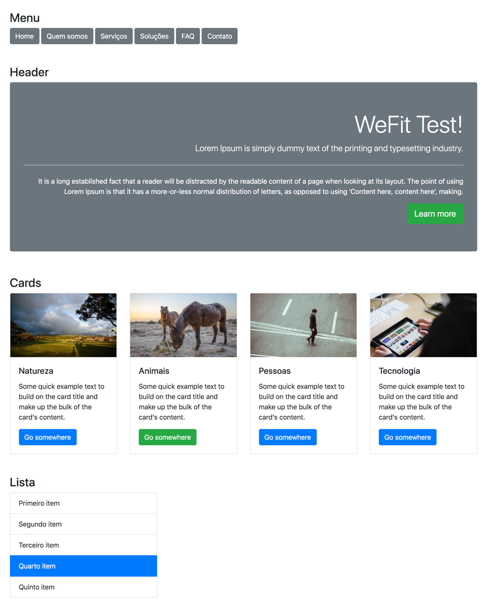

# WeFit Test Javascript

  

---

<h3 align="center">
  <a href="#information_source-sobre">Sobre</a>&nbsp;|&nbsp;
  <a href="#interrobang-motivo">Motivo</a>&nbsp;|&nbsp;
  <a href="#rocket-tecnologias-utilizadas">Tecnologias</a>&nbsp;|&nbsp;
  <a href="#art-layout">Layout</a>
</h3>

---

## :information_source: Sobre

Transformar através do #JS (wefit-test/js/main.js) o HTML/DOM de acordo com os prints (/Roteiro-teste-WeFit).

O resultado deve ser o mais próximo possível do esperado.

## :interrobang: Motivo

Demostrar o domínio das APIs básicas do JavaScript e qualidade de código.

## :rocket: Tecnologias Utilizadas

- [Bootstrap v4.3.1](https://getbootstrap.com/)
- [normalize.css](github.com/necolas/normalize.css)
- [HTML5 Boilerplate](https://html5boilerplate.com/)
- [jQuery v3.4.1](https://github.com/h5bp/main.css#readme)
- [modernizr 3.7.1](https://modernizr.com/download/?-cssanimations-csscolumns-customelements-flexbox-history-picture-pointerevents-postmessage-sizes-srcset-webgl-websockets-webworkers-addtest-domprefixes-hasevent-mq-prefixedcssvalue-prefixes-setclasses-testallprops-testprop-teststyles)

## :art: Layout

  

---

<h4 align="center">
  Feito por Jerp 👋️
</h4>
<h5 align="center">
  <a href="mailto:jerp.dev@gmail.com">Entre em contato!</a>
</h5>

  

